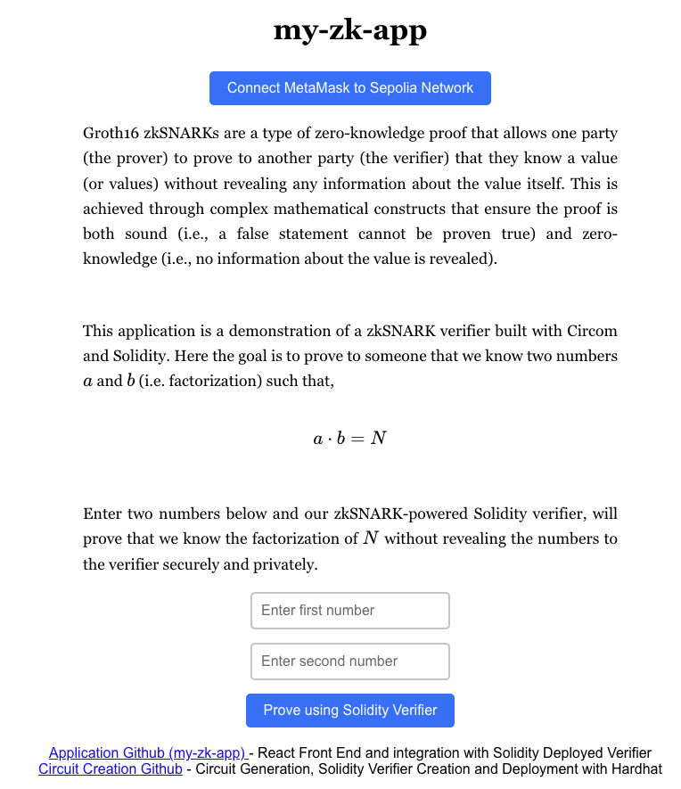
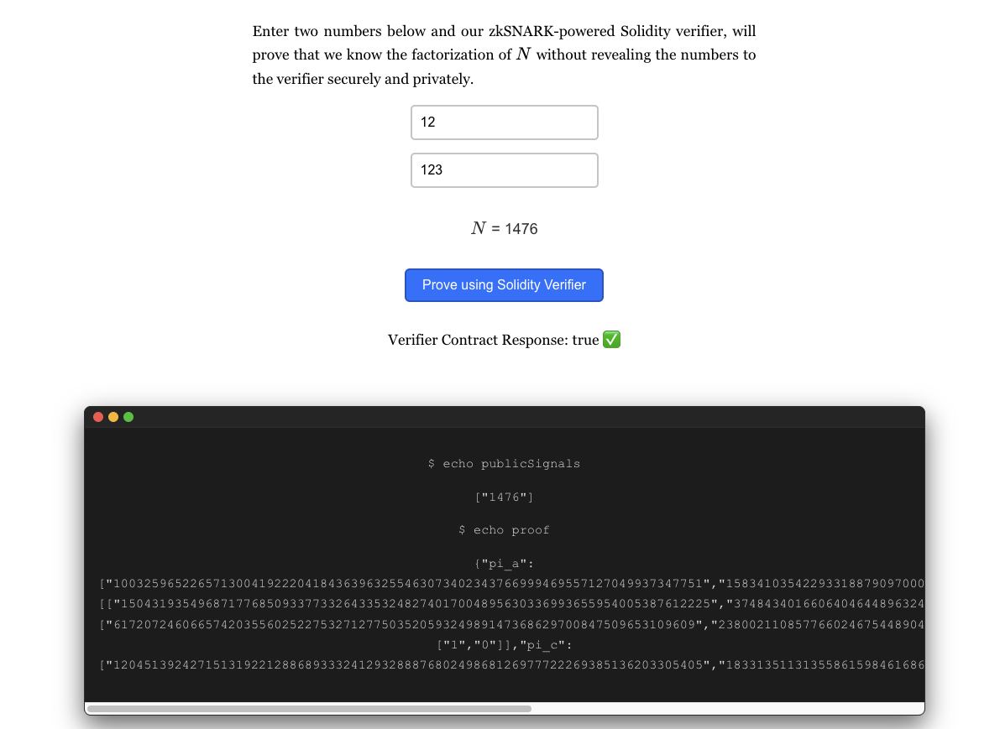

# my-zk-app

*To interact with application, make sure to enable Sepolia network in metamask account.*

This application showcases a simple implementation of a Zero Knowledge Proof with Solidity Verifiers deployed on the Sepolia network. 

<p align="center">

</p>

Submitting proof will output some details sent to the verifier. 

<p align="center">

</p>

The solidity verifier and circuit generation was done via Circom. All those details are found in this repo:
* https://github.com/wgopar/zk-prototype

This react application used the following generated files from above repo in order to perform the zkProof:
```
multiplier.wasm
multiplier.zkey
witness_calculator.js
```
Solidity Verifier was also deployed in above repo using Hardhat and the Contract ABI is referenced in this react application so we can verify proofs securely onchain. 


Verifier Contract 
`https://sepolia.etherscan.io/address/0xeeaa66d09be70e9d1f44f31440c9ac1cf1e80b23#code`